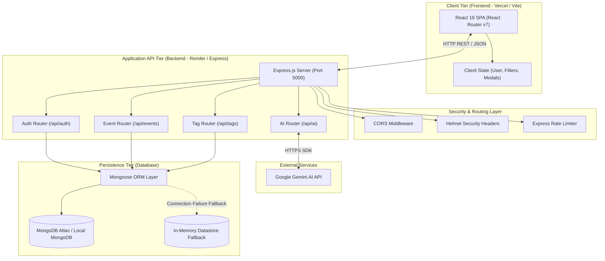
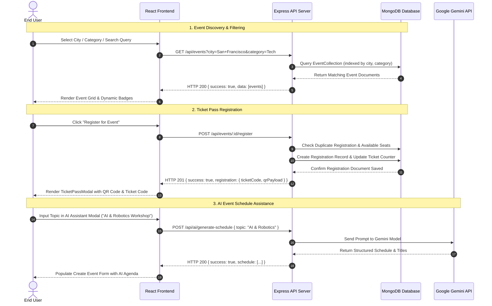

# High-Level Design (HLD) — City Pulse

This document presents the **High-Level Design (HLD)** specifications for **City Pulse**, detailing the system architecture, component breakdown, data workflows, and non-functional requirements.

---

## 1. Executive Summary & System Overview

**City Pulse** is a dual-tier web application built to streamline local event discovery, ticket reservation, and host event management. Users can explore city-specific tech summits, concerts, networking mixers, and workshops; register for events to receive instant digital ticket passes; and host events complete with attendee roster tracking and AI-driven event creation.

---

## 2. System Architecture Diagram

---

## 3. Core System Components

| Component | Technology | Primary Responsibility |
|---|---|---|
| **Frontend App** | React 19, Vite, React Router v7 | Renders interactive single-page UI, handles route navigation, client state, modal overlays, and visual effects (GSAP, OGL, CSS custom design system). |
| **API Server** | Node.js, Express.js 4 | Implements RESTful endpoints, request validation, business logic, authentication handling, and rate limiting. |
| **Database Tier** | MongoDB, Mongoose 9 | Stores persistent user credentials, profile attributes, event listings, tags, and attendee registrations. |
| **AI Integration** | Google Gemini API (`@google/genai`) | Generates structured event agendas, titles, descriptions, and schedule suggestions dynamically based on user prompts. |
| **Resilience Layer** | Dual Storage Strategy | Gracefully handles MongoDB connection availability with automatic retry and local/in-memory fallback data models. |

---

## 4. High-Level Data Flow & Primary User Workflows

---

## 5. Non-Functional Requirements (NFRs)

- **Security & Integrity**:
  - Passwords hashed using `bcryptjs` (salt factor 10).
  - Production Security HTTP headers via `helmet`.
  - Rate limiting on public API routes via `express-rate-limit` (100 requests per 15 min per IP).
  - Strict CORS policy matching `CLIENT_URL` environment whitelist.
- **Performance & Optimization**:
  - Vite bundling with rolldown/oxc for ultra-fast HMR and small bundle footprint.
  - Client-side memoization and deferred image loading.
  - Indexed database queries on `city`, `category`, and `organizerId`.
- **Availability & Resilience**:
  - Non-blocking database connection strategy (server boots immediately; retries DB in background).
  - Graceful fallback datastore ensuring high availability even during DB maintenance.
