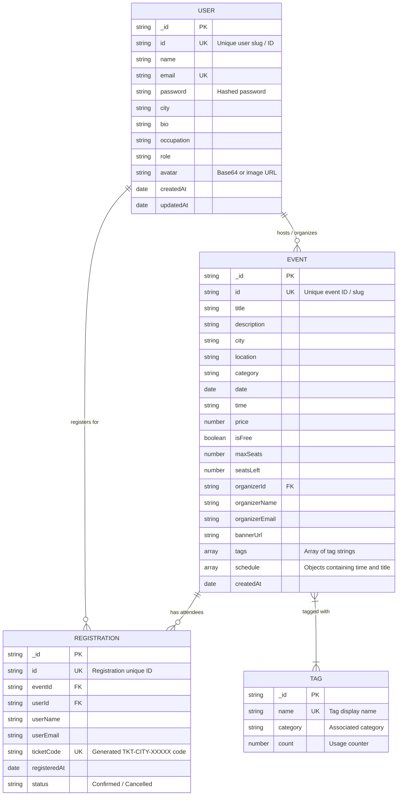

# Low-Level Design (LLD) — City Pulse

This document presents the **Low-Level Design (LLD)** specifications for **City Pulse**, detailing the database schemas, entity relationships, module breakdowns, API specs, and core algorithms.

---

## 1. Database Schema & Entity-Relationship (ER) Diagram



---

## 2. Module & Code Structure Breakdown

### Backend Architecture (`/server`)

```text
server/
├── server.js               # Application entry point, middleware pipeline & DB bootstrapper
├── config/                 # Environment & global configuration variables
├── controllers/            # Business logic handlers
│   ├── aiController.js     # Gemini API invocation & prompt construction
│   ├── authController.js   # Authentication, user creation & profile updates
│   └── eventController.js  # CRUD operations for events, registration & roster lookup
├── models/                 # Mongoose schemas & dual datastore models
│   ├── mongoSchemas.js     # Mongoose Schemas (User, Event, Registration, Tag)
│   ├── mongoUserModel.js   # Mongoose User model wrapper
│   ├── mongoEventModel.js  # Mongoose Event model wrapper
│   ├── userModel.js        # Combined DB/Fallback user handler
│   ├── eventModel.js       # Combined DB/Fallback event handler
│   └── registrationModel.js# Combined DB/Fallback registration handler
├── routes/                 # Express Router endpoint definitions
│   ├── aiRoutes.js         # /api/ai endpoints
│   ├── authRoutes.js       # /api/auth endpoints
│   ├── eventRoutes.js      # /api/events endpoints
│   └── tagRoutes.js        # /api/tags endpoints
└── utils/                  # Helper utilities & core algorithms
    ├── jsCoreConcepts.js   # Core utility algorithms (Closures, Promises, Event Loop)
    └── tagSuggester.js     # Tag recommendation logic based on event category/description
```

### Frontend Architecture (`/Client`)

```text
Client/src/
├── App.jsx                 # Top-level router, theme provider & main layout shell
├── main.jsx                # DOM mounting & React root rendering
├── pages/                  # Top-level page views
│   ├── EventExplorer.jsx   # Search, city selector, tag filter bar & event grid
│   ├── Dashboard.jsx       # User dashboard (My Tickets, Hosted Events, Attendee Rosters)
│   ├── ProfileSettings.jsx # Profile edit form & security credentials
│   ├── CreateProfile.jsx   # Initial profile onboarding workflow
│   ├── Login.jsx           # User authentication login page
│   └── Register.jsx        # Account registration page
├── components/             # Reusable UI components & modal overlays
│   ├── EventCard.jsx       # Event card thumbnail with pricing & capacity badges
│   ├── EventModal.jsx       # Event detailed view & ticket registration modal
│   ├── TicketPassModal.jsx # Pass view displaying ticket code & QR visual
│   ├── AttendeeRosterModal.jsx # Host view for attendee list & CSV export
│   ├── CreateEventModal.jsx# Form overlay for hosting a new event
│   ├── AIEventAssistantModal.jsx # Gemini AI agenda generation modal
│   ├── TagFilterBar.jsx    # Interactive category & tag pill selection bar
│   └── CitySelector.jsx    # City selection chips
└── config/
    └── api.js              # Base API URL configuration resolution
```

---

## 3. API Contract & Endpoints Specification

### A. Authentication & User Profile (`/api/auth`)

| Method | Endpoint | Description | Request Body / Parameters | Response Format |
|---|---|---|---|---|
| `POST` | `/api/auth/register` | Register new user | `{ name, email, password, city }` | `{ success: true, user: {...} }` |
| `POST` | `/api/auth/login` | Authenticate user | `{ email, password }` | `{ success: true, user: {...} }` |
| `GET` | `/api/auth/profile/:id` | Fetch user profile | `id` (URL Param) | `{ success: true, user: {...} }` |
| `PUT` | `/api/auth/profile/:id` | Update profile info | `{ name, city, bio, occupation, avatar }` | `{ success: true, user: {...} }` |

### B. Event Management & Registrations (`/api/events`)

| Method | Endpoint | Description | Request Body / Parameters | Response Format |
|---|---|---|---|---|
| `GET` | `/api/events` | List events with filters | `?city=...&category=...&search=...` | `{ success: true, data: [...] }` |
| `GET` | `/api/events/:id` | Get event details | `id` (URL Param) | `{ success: true, data: {...} }` |
| `POST` | `/api/events` | Host / Create new event | `{ title, description, city, location, price, maxSeats, date, time, tags, schedule }` | `{ success: true, data: {...} }` |
| `DELETE` | `/api/events/:id` | Delete hosted event | `id` (URL Param) | `{ success: true, message: "Event deleted" }` |
| `POST` | `/api/events/:id/register` | Register for ticket pass | `{ userId, userName, userEmail }` | `{ success: true, registration: {...} }` |
| `GET` | `/api/events/user/:userId/registrations` | Fetch user ticket passes | `userId` (URL Param) | `{ success: true, data: [...] }` |
| `DELETE` | `/api/events/user/:userId/registrations/:regId` | Cancel registration | `userId`, `regId` (URL Params) | `{ success: true, message: "Cancelled" }` |
| `GET` | `/api/events/:id/attendees` | Get host attendee roster | `id` (URL Param) | `{ success: true, data: [...] }` |

### C. AI Assistant (`/api/ai`)

| Method | Endpoint | Description | Request Body | Response Format |
|---|---|---|---|---|
| `POST` | `/api/ai/generate-schedule` | Generate AI event agenda | `{ topic, city, category }` | `{ success: true, data: { titles: [...], schedule: [...] } }` |

---

## 4. Low-Level Component Diagrams & Algorithms

### Ticket Code Generation Algorithm (`server/utils/jsCoreConcepts.js`)

Uses a closure to encapsulate ticket counting state per city:

```javascript
export function createTicketCodeCounter(cityPrefix) {
  let counter = 1000; // Enclosed private state variable

  return function generateNextTicket() {
    counter += 1;
    return `TKT-${cityPrefix.toUpperCase()}-${counter}`;
  };
}
```

### CSV Attendee Roster Export Algorithm (`Client/src/components/AttendeeRosterModal.jsx`)

Formats attendee objects into a downloadable CSV blob:

```javascript
const handleExportCSV = () => {
  const headers = ['Attendee Name', 'Email', 'Ticket Code', 'Registration Date', 'Status'];
  const rows = attendees.map(a => [
    `"${a.userName || ''}"`,
    `"${a.userEmail || ''}"`,
    `"${a.ticketCode || ''}"`,
    `"${a.registeredAt ? new Date(a.registeredAt).toLocaleDateString() : ''}"`,
    `"${a.status || 'Confirmed'}"`
  ]);

  const csvContent = 'data:text/csv;charset=utf-8,' 
    + [headers.join(','), ...rows.map(r => r.join(','))].join('\n');
    
  const encodedUri = encodeURI(csvContent);
  const link = document.createElement('a');
  link.setAttribute('href', encodedUri);
  link.setAttribute('download', `${event.title.replace(/[^a-z0-9]/gi, '_')}_Attendees.csv`);
  document.body.appendChild(link);
  link.click();
  document.body.removeChild(link);
};
```
